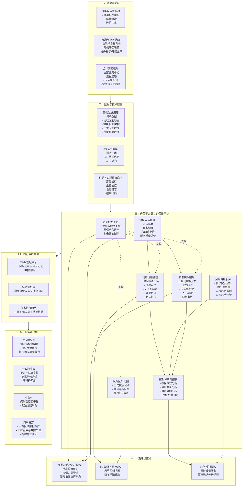

# 农业风险减量产品框架图

## 图示说明

- 产品核心定位：围绕“精准承保 + 风险区划 + 风险减量 + 精准理赔”构建一体化科技服务平台。
- 业务闭环主线：保险公司发起需求，平台组织任务，卫星/无人机/地面协同执行，最终输出核保、预警、理赔与报告结果。
- 一期优先级：以“精准核保服务闭环”作为首要建设重点，基础地图与协保任务调度作为配套支撑能力。
- 二三期方向：逐步增强风险区划、理赔辅助、风险减量与数据资产运营能力。

